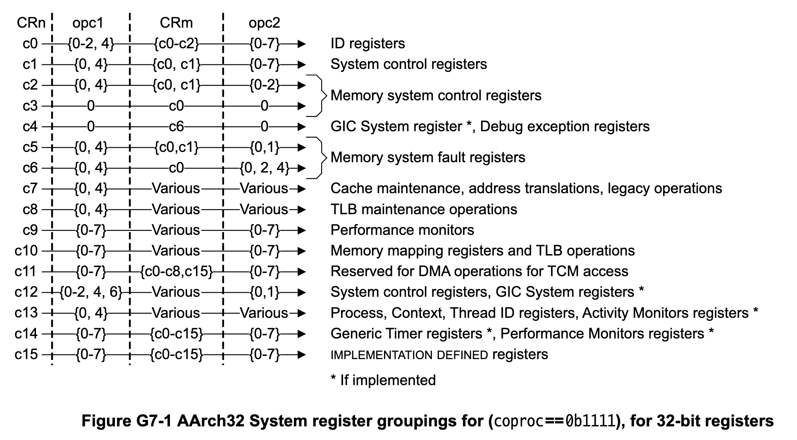
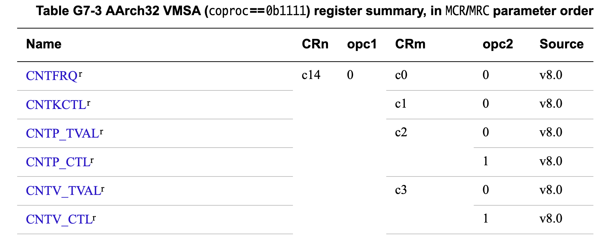

# インストール

## brewによるツールのインストール

```sh
$ brew install arm-none-eabi-gcc	# 後で変更
$ brew install lua
$ brew install e2tools
$ brew install --cask macfuse
$ brew install xmake
```

## カーネルビルド

### xmakeによる

```sh
$ git status
$ git status
On branch ja
Changes not staged for commit:
  (use "git add <file>..." to update what will be committed)
  (use "git restore <file>..." to discard changes in working directory)
	modified:   kernel/hardware/arm/arch/common/src/irq.c
	modified:   kernel/hardware/arm/arch/v7/neon.c
	modified:   kernel/hardware/arm/raspi/lib/bcm283x/src/pl011_uart.c
	modified:   kernel/hardware/arm/raspi/pix/bsp/core.c
	modified:   kernel/hardware/arm/raspi/pix/xmake.lua
	modified:   kernel/kernel/include/kernel/elf.h
	modified:   kernel/kernel/src/irq.c
	modified:   kernel/kernel/src/kernel.c
	modified:   kernel/kernel/src/kernel_config.c
	modified:   kernel/kernel/src/mm/shm.c
	modified:   kernel/kernel/src/mm/trunkmem.c
	modified:   kernel/kernel/src/proc.c
	modified:   kernel/kernel/src/svc.c
	modified:   kernel/lib/ext2/src/ext2read.c
	modified:   kernel/lib/include/kstring.h
	modified:   kernel/lib/sconf/src/sconf.c
	modified:   kernel/lib/src/mstr.c
	modified:   kernel/loadinit/sd/loadinit.c
	modified:   kernel/xmake.lua
	modified:   system/basic/Makefile
	modified:   system/full/drivers/consoled/xmake.lua
	modified:   system/full/drivers/displayd/xmake.lua
	modified:   system/full/drivers/fontd/xmake.lua
$ cd kernel
$ ls -a
.		dev		kernel		loadinit	xmake.lua
..		hardware	lib		makefile
$ make raspi2.3 > xmake.log 2> xmake_err.log
$ ls -a
.		build		kernel		makefile	xmake_err.log
..		dev		lib		xmake.log
.xmake		hardware	loadinit	xmake.lua
```

- linkディレクトリが設定されておらず、link時エラーが発生してカーネルは作成されず

### makeによる

```diff
$ git diff kernel/hardware/arm/make.rule
diff --git a/kernel/hardware/arm/make.rule b/kernel/hardware/arm/make.rule
index f775581e3..fc812bbf3 100644
--- a/kernel/hardware/arm/make.rule
+++ b/kernel/hardware/arm/make.rule
@@ -50,6 +50,7 @@ CFLAGS += $(OPTM) \
        -I$(SRC_DIR)/dev/include \
        -I$(ARCH_DIR)/$(ARCH) \
        -I$(ARCH_DIR)/common/include \
+       -I$(SDKROOT)/usr/include \
        -marm $(ARCH_CFLAGS) \
        -Wstrict-prototypes \
        -pedantic -Wall -Wextra -msoft-float -fPIC -mapcs-frame \
@@ -65,6 +66,7 @@ CFLAGS += $(OPTM) \
        -fno-builtin-strlen \
        -fno-builtin-strncpy \
        -fno-builtin-strncmp \
+       -Wno-builtin-declaration-mismatch \
        -std=c99

```

```sh
$ cd kernel/hardware/arm/raspi/pix
$ ls
Makefile		make.bsp		mkos.lds.qemu.S
README.md		make.bsp.clockwork	xmake.lua
bsp			make.bsp.pi4
config.mk		mkos.lds.S
$ make > make.log 2> make_err.log
$ ls
Makefile		kernel7.qemu.elf	make_err.log
README.md		kernel7.qemu.img	mkos.lds.S
bsp			make.bsp		mkos.lds.qemu.S
config.mk		make.bsp.clockwork	xmake.lua
kernel7.elf		make.bsp.pi4
kernel7.img		make.log
```

- カーネルイメージ`kernel7.img`が作成される

### toolchainを変える

```sh
$ brew uninstall arm-node-eabi-gcc
$ brew autoremove
$ brew install --cask gcc-arm-embedded
$ vi kernel/hardware/arm/make.rule
-I$(SDKROOT)/usr/include を削除
$ cd kernel/hardware/arm/raspi/pix
$ make
$ ls
Makefile		kernel7.qemu.elf	make_err.log
README.md		kernel7.qemu.img	mkos.lds.S
bsp			make.bsp		mkos.lds.qemu.S
config.mk		make.bsp.clockwork	xmake.lua
kernel7.elf		make.bsp.pi4
kernel7.img		make.log
```

## systemの作成

### basic systemのビルド

```sh
$ cd system/hardware/arm/raspix
$ make basic > basic.log 2> basic_err.log
$ ls ../../../build/raspix/
bin	drivers	etc	home	sbin
```

### rootfsの作成

```sh
$ make sd

====building ext2 format sdcard image====
mkdir -p build
dd if=/dev/zero of=build/root.ext2 bs=1k count=128k
131072+0 records in
131072+0 records out
134217728 bytes transferred in 0.260430 secs (515369689 bytes/sec)
mke2fs -b 1024 -I 128 build/root.ext2
mke2fs 1.47.1 (20-May-2024)
128-byte inodes cannot handle dates beyond 2038 and are deprecated
Creating filesystem with 131072 1k blocks and 32768 inodes
Filesystem UUID: 62b62f3c-7c2d-49bc-acaf-6f0f22b9bee4
Superblock backups stored on blocks:
	8193, 24577, 40961, 57345, 73729

Allocating group tables: done
Writing inode tables: done
Writing superblocks and filesystem accounting information: done

==== ext2 format sdcard image created  ====
$ $ ls -l build
total 262144
-rw-r--r--  1 zuki  staff  134217728  8 17 16:44 root.ext2
```

# QEMUでの実行

```sh
$ cd system/hardware/arm/raspix
$ make run

qemu-system-arm -M raspi2b -m 1024M -serial mon:stdio -kernel ../../../../kernel/hardware/arm/raspi/pix/kernel7.qemu.img -sd build/root.ext2
WARNING: Image format was not specified for 'build/root.ext2' and probing guessed raw.
         Automatically detecting the format is dangerous for raw images, write operations on block 0 will be restricted.
         Specify the 'raw' format explicitly to remove the restrictions.

=== ewokos booting ===

kernel: init kernel malloc     ... [OK]
kernel: init kernel event      ... [OK]
kernel: init sd                ... [OK]
kernel: load kernel config     ... [OK]

    machine              raspberry-pi2b
    arch                 armv7
    cores                4
    kernel_timer_freq    8192
    schedule_freq        512
    mem_offset           0x0
    mem_size             1024 MB
    kmalloc size         11 MB
    mmio_base            Phy:0x3f000000, V: 0xe0000000
    max proc num         64
    max task total       256
    max task per proc    64

kernel: remapping kernel mem   ... [OK]
kernel: init framebuffer       ... qemu-system-arm: warning: Blocked re-entrant IO on MemoryRegion: bcm2835-fb at addr: 0x0
[OK]
---------------------------------------------------
 ______           ______  _    _   ______  ______
(  ___ \|\     /|(  __  )| \  / \ (  __  )(  ___ \
| (__   | | _ | || |  | || (_/  / | |  | || (____
|  __)  | |( )| || |  | ||  _  (  | |  | |(____  )
| (___  | || || || |__| || ( \  \ | |__| |  ___) |
(______/(_______)(______)|_/  \_/ (______)\______)

kernel: init allocable memory  ... [ok] (934 MB)
kernel: init DMA               ... [OK]
kernel: init semaphore         ... [ok]
kernel: init irq               ... [ok]
kernel: init share memory      ... [ok]
kernel: init processes table   ... [ok] (64)
kernel: loading init process   ... [ok]
kernel: start core 1           ... [ok]
kernel: start core 2           ... [ok]
kernel: start core 3           ... [ok]
kernel: set timer              ... [ok]
kernel: start init process     ...
---------------------------------------------------

[init process started]
init: /sbin/core    [ok]
init: /sbin/vfsd    [ok]
init: /sbin/sdfsd
    init sdc ... [ok]
    init ext2 fs ... [ok]
[ok]

init: loading '/etc/init0.rd' ...
init: initailizing stdio at '/dev/tty0' ... [ok]

init: loading '/etc/init.rd' ...
/bin/ipcserv /drivers/timerd               /dev/timer
/bin/ipcserv /drivers/nulld                /dev/null
/bin/ipcserv /drivers/ramfsd               /tmp
/bin/ipcserv /drivers/proc/sysinfod        /proc/sysinfo
/bin/ipcserv /drivers/proc/stated          /proc/state

+-----Ewok micro-kernel OS-----------------------+
| https://github.com/MisaZhu/EwokOS.git          |
+------------------------------------------------+
[/dev/tty0] login: root
[/dev/tty0] password:
[/dev/tty0]:/# ls
drwx------  root     root        12288  [lost+found]
drwxr-xr-x  root     root         1024  [drivers]
drwxr-xr-x  root     root         1024  [bin]
drwxr-xr-x  root     root         1024  [sbin]
drwxr-xr-x  root     root         1024  [etc]
drwxr-xr-x  root     root         1024  [dev]
drwxrwxrwx  root     root         1024  [tmp]
drwxr-xr-x  root     root         1024  [proc]
[/dev/tty0]:/# ls drivers
drwxr-xr-x  root     root         1024  [proc]
-rwxr-xr-x  501      20         226772  netd
drwxr-xr-x  root     root         1024  [raspix]
-rwxr-xr-x  501      20         163064  timerd
-rwxr-xr-x  501      20         160020  nulld
-rwxr-xr-x  501      20         160284  ramfsd
[/dev/tty0]:/# ls bin
-rwxr-xr-x  501      20         138188  cat
-rwxr-xr-x  501      20         137336  mkfifo
-rwxr-xr-x  501      20         139452  svcinfo
-rwxr-xr-x  501      20         153096  md5
-rwxr-xr-x  501      20         207512  vi
-rwxr-xr-x  501      20         152904  dump
-rwxr-xr-x  501      20         138380  echo
-rwxr-xr-x  501      20         137956  ipcserv
-rwxr-xr-x  501      20         137304  pwd
-rwxr-xr-x  501      20         139152  test
-rwxr-xr-x  501      20         138868  whoami
-rwxr-xr-x  501      20         136976  sleep
-rwxr-xr-x  501      20         159560  shell
-rwxr-xr-x  501      20         138104  setux
-rwxr-xr-x  501      20         137816  uname
-rwxr-xr-x  501      20         142568  tsaver
-rwxr-xr-x  501      20         137716  elfinfo
-rwxr-xr-x  501      20         138024  grep
-rwxr-xr-x  501      20         138076  clear
-rwxr-xr-x  501      20         138132  kill
-rwxr-xr-x  501      20         161592  ps
-rwxr-xr-x  501      20         154860  json
-rwxr-xr-x  501      20         162824  devcmd
-rwxr-xr-x  501      20         137328  mkdir
-rwxr-xr-x  501      20         137280  mount
-rwxr-xr-x  501      20         153548  ls
-rwxr-xr-x  501      20         138828  cp
-rwxr-xr-x  501      20         139440  chown
-rwxr-xr-x  501      20         137936  chmod
-rwxr-xr-x  501      20         137560  rm
-rwxr-xr-x  501      20         140552  rx
-rwxr-xr-x  501      20         154736  login
-rwxr-xr-x  501      20         145872  session
[/dev/tty0]:/# ls sbin
-rwxr-xr-x  501      20         156072  sessiond
-rwxr-xr-x  501      20         183016  init
-rwxr-xr-x  501      20         143184  core
-rwxr-xr-x  501      20         163800  vfsd
-rwxr-xr-x  501      20         143148  telnetd
-rwxr-xr-x  501      20         157984  httpd
-rwxr-xr-x  501      20         191676  sdfsd
[/dev/tty0]:/# ls etc
-rw-r--r--  501      20            304  init.rd
-rw-r--r--  501      20             52  init0.rd
drwxr-xr-x  root     root         1024  [wlan]
drwxr-xr-x  root     root         1024  [kernel]
-rw-r--r--  501      20            175  passwd
[/dev/tty0]:/# cat etc/passwd
root:0:0:/home/root:/bin/shell:63a9f0ea7bb98050796b649e85481845
misa:100:100:/home/misa:/bin/shell:b201272a7344411b1dd09d7b8a3f25b3
guest:1000:1000:/tmp/home/guest:/bin/shell:[/dev/tty0]:/#
[/dev/tty0]:/# cat etc/init.rd
/bin/ipcserv /drivers/timerd               /dev/timer
/bin/ipcserv /drivers/nulld                /dev/null
/bin/ipcserv /drivers/ramfsd               /tmp
/bin/ipcserv /drivers/proc/sysinfod        /proc/sysinfo
/bin/ipcserv /drivers/proc/stated          /proc/state

@/sbin/sessiond &
@/bin/session -r &[/dev/tty0]:/# ls /proc
-r--r--r--  root     root            0  sysinfo
-r--r--r--  root     root            0  state
[/dev/tty0]:/# cat /proc/sysinfo
machine: raspberry-pi2b
cores: 4
phy_mem_size: 1024 MB
max proc num: 64
max task total: 256
max task per proc: 64
max files per_proc: 128
mmio_base: 0x3f000000
[/dev/tty0]:/# exit
QEMU: Terminated
```


# AArch32コプロセッサ

- Arm Architecture Reference Manual for A-profile architecture
  - G7.3 Organization of registers in the (coproc==0b1111) encoding space
  - Figure G7-1 AArch32 System register groupings for (coproc==0b1111)
    
  - Table G7-3 AArch32 VMSA (coproc==0b1111) register summary
    

# ソースツリー

## カーネル

[カーネルソース](kernel.tree)

## システム

[システムソース](system.tree)

# AArch32のMMUについて

- [APSのMMUに関する解説](https://www.aps-web.jp/academy/ca/228/)を参照

# SDイメージの作成

- Linuxで実行

```bash
$ make clean
rm -f ewokos-ext2-image.bin

$ make
make create-image
make[1]: ディレクトリ '/home/zuki/ewokos' に入ります
dd if=/dev/zero of=ewokos-ext2-image.bin bs=4096 count=1048576
1048576+0 records in
1048576+0 records out
4294967296 bytes (4.3 GB, 4.0 GiB) copied, 1.75066 s, 2.5 GB/s
dd if=partition-table.bin of=ewokos-ext2-image.bin bs=512 count=1 conv=notrunc
1+0 records in
1+0 records out
512 bytes copied, 3.1292e-05 s, 16.4 MB/s
sudo losetup --offset 272629760 /dev/loop20 ewokos-ext2-image.bin
sudo mkfs.ext2 -vvvv -b 1024 /dev/loop20 3928064
mke2fs 1.47.0 (5-Feb-2023)
fs_types for mke2fs.conf resolution: 'ext2'
Discarding device blocks: done
Filesystem label=
OS type: Linux
Block size=1024 (log=0)
Fragment size=1024 (log=0)
Stride=0 blocks, Stripe width=0 blocks
245760 inodes, 3928064 blocks
196403 blocks (5.00%) reserved for the super user
First data block=1
Maximum filesystem blocks=71041024
480 block groups
8192 blocks per group, 8192 fragments per group
512 inodes per group
Filesystem UUID: c92927c0-5edc-4b27-a15f-32528312c652
Superblock backups stored on blocks:
	8193, 24577, 40961, 57345, 73729, 204801, 221185, 401409, 663553,
	1024001, 1990657, 2809857

Allocating group tables: done
Writing inode tables: done
Writing superblocks and filesystem accounting information: done

sudo losetup -d /dev/loop20
make[1]: ディレクトリ '/home/zuki/ewokos' から出ます
make create-fat
make[1]: ディレクトリ '/home/zuki/ewokos' に入ります
sudo losetup --offset 4194304 /dev/loop20 ewokos-ext2-image.bin
sudo mkfs.vfat -v -F 32 -n BOOT /dev/loop20 262144
mkfs.fat 4.2 (2021-01-31)
Warning: block count mismatch: found 4190208 but assuming 262144.
WARNING: Number of clusters for 32 bit FAT is less then suggested minimum.
/dev/loop20 has 255 heads and 63 sectors per track,
hidden sectors 0x0000;
logical sector size is 512,
using 0xf8 media descriptor, with 524286 sectors;
drive number 0x80;
filesystem has 2 32-bit FATs and 8 sectors per cluster.
FAT size is 512 sectors, and provides 65403 clusters.
There are 32 reserved sectors.
Volume ID is e49a23ab, volume label BOOT.
sudo losetup -d /dev/loop20
make[1]: ディレクトリ '/home/zuki/ewokos' から出ます
make load-image
make[1]: ディレクトリ '/home/zuki/ewokos' に入ります
make mount-image
make[2]: ディレクトリ '/home/zuki/ewokos' に入ります
sudo losetup --offset 272629760 /dev/loop20 ewokos-ext2-image.bin
sudo mount -t ext2 /dev/loop20 build
make[2]: ディレクトリ '/home/zuki/ewokos' から出ます
sudo cp -r raspix/* build/
make umount-image
make[2]: ディレクトリ '/home/zuki/ewokos' に入ります
sudo umount build
sudo losetup -d /dev/loop20
make[2]: ディレクトリ '/home/zuki/ewokos' から出ます
make[1]: ディレクトリ '/home/zuki/ewokos' から出ます
```

- 別の方法で実行

```bash
$ brew install e2fsprogs        # mke2fs
$ brew install e2tools          # e2cp
$ brew install mtools           # mformat, mcopy
$ brew install util-linux       # sfdisk

$ vi make_sd.mk

$ make -f make_sd.mk
dd if=/dev/zero of=sd/boot.img seek=$((512*1024 - 1)) bs=512 count=1
1+0 records in
1+0 records out
512 bytes transferred in 0.000096 secs (5333333 bytes/sec)
mformat -F -c 1 -i sd/boot.img ::
mcopy -i sd/boot.img boot ::boot;  mcopy -i sd/boot.img boot/config.txt ::config.txt;  mcopy -i sd/boot.img boot/bootcode.bin ::bootcode.bin;  mcopy -i sd/boot.img boot/fixup.dat ::fixup.dat;  mcopy -i sd/boot.img boot/start.elf ::start.elf;  mcopy -i sd/boot.img boot/kernel7.img ::kernel7.img;
dd if=/dev/zero of=sd/ext2.img bs=1024 count=3836*1024
3928064+0 records in
3928064+0 records out
4022337536 bytes transferred in 7.315377 secs (549846923 bytes/sec)
mke2fs -b 1024 -t ext2 sd/ext2.img
mke2fs 1.47.1 (20-May-2024)
Creating filesystem with 3928064 1k blocks and 245760 inodes
Filesystem UUID: 557c65bc-4381-4165-9bc4-122de2c50576
Superblock backups stored on blocks:
	8193, 24577, 40961, 57345, 73729, 204801, 221185, 401409, 663553,
	1024001, 1990657, 2809857

Allocating group tables: done
Writing inode tables: done
Writing superblocks and filesystem accounting information: done

e2cp -ap -G0 -O0 -d sd/ext2.img:/ ../../../build/raspix/drivers/proc/stated;  e2cp -ap -G0 -O0 -d sd/ext2.img:/ ../../../build/raspix/drivers/proc/sysinfod;  e2cp -ap -G0 -O0 -d sd/ext2.img:/ ../../../build/raspix/drivers/netd;  e2cp -ap -G0 -O0 -d sd/ext2.img:/ ../../../build/raspix/drivers/raspix/soundd;  e2cp -ap -G0 -O0 -d sd/ext2.img:/ ../../../build/raspix/drivers/raspix/uartd;  e2cp -ap -G0 -O0 -d sd/ext2.img:/ ../../../build/raspix/drivers/raspix/hid_joystickd;  e2cp -ap -G0 -O0 -d sd/ext2.img:/ ../../../build/raspix/drivers/raspix/mbox_actledd;  e2cp -ap -G0 -O0 -d sd/ext2.img:/ ../../../build/raspix/drivers/raspix/gpio_actledd;  e2cp -ap -G0 -O0 -d sd/ext2.img:/ ../../../build/raspix/drivers/raspix/spi2uartd;  e2cp -ap -G0 -O0 -d sd/ext2.img:/ ../../../build/raspix/drivers/raspix/hid_moused;  e2cp -ap -G0 -O0 -d sd/ext2.img:/ ../../../build/raspix/drivers/raspix/wland;  e2cp -ap -G0 -O0 -d sd/ext2.img:/ ../../../build/raspix/drivers/raspix/usbd;  e2cp -ap -G0 -O0 -d sd/ext2.img:/ ../../../build/raspix/drivers/raspix/hid_keybd;  e2cp -ap -G0 -O0 -d sd/ext2.img:/ ../../../build/raspix/drivers/timerd;  e2cp -ap -G0 -O0 -d sd/ext2.img:/ ../../../build/raspix/drivers/nulld;  e2cp -ap -G0 -O0 -d sd/ext2.img:/ ../../../build/raspix/drivers/ramfsd;  e2cp -ap -G0 -O0 -d sd/ext2.img:/ ../../../build/raspix/bin/cat;  e2cp -ap -G0 -O0 -d sd/ext2.img:/ ../../../build/raspix/bin/mkfifo;  e2cp -ap -G0 -O0 -d sd/ext2.img:/ ../../../build/raspix/bin/svcinfo;  e2cp -ap -G0 -O0 -d sd/ext2.img:/ ../../../build/raspix/bin/md5;  e2cp -ap -G0 -O0 -d sd/ext2.img:/ ../../../build/raspix/bin/vi;  e2cp -ap -G0 -O0 -d sd/ext2.img:/ ../../../build/raspix/bin/dump;  e2cp -ap -G0 -O0 -d sd/ext2.img:/ ../../../build/raspix/bin/echo;  e2cp -ap -G0 -O0 -d sd/ext2.img:/ ../../../build/raspix/bin/ipcserv;  e2cp -ap -G0 -O0 -d sd/ext2.img:/ ../../../build/raspix/bin/pwd;  e2cp -ap -G0 -O0 -d sd/ext2.img:/ ../../../build/raspix/bin/test;  e2cp -ap -G0 -O0 -d sd/ext2.img:/ ../../../build/raspix/bin/whoami;  e2cp -ap -G0 -O0 -d sd/ext2.img:/ ../../../build/raspix/bin/sleep;  e2cp -ap -G0 -O0 -d sd/ext2.img:/ ../../../build/raspix/bin/shell;  e2cp -ap -G0 -O0 -d sd/ext2.img:/ ../../../build/raspix/bin/setux;  e2cp -ap -G0 -O0 -d sd/ext2.img:/ ../../../build/raspix/bin/uname;  e2cp -ap -G0 -O0 -d sd/ext2.img:/ ../../../build/raspix/bin/tsaver;  e2cp -ap -G0 -O0 -d sd/ext2.img:/ ../../../build/raspix/bin/elfinfo;  e2cp -ap -G0 -O0 -d sd/ext2.img:/ ../../../build/raspix/bin/grep;  e2cp -ap -G0 -O0 -d sd/ext2.img:/ ../../../build/raspix/bin/clear;  e2cp -ap -G0 -O0 -d sd/ext2.img:/ ../../../build/raspix/bin/kill;  e2cp -ap -G0 -O0 -d sd/ext2.img:/ ../../../build/raspix/bin/ps;  e2cp -ap -G0 -O0 -d sd/ext2.img:/ ../../../build/raspix/bin/json;  e2cp -ap -G0 -O0 -d sd/ext2.img:/ ../../../build/raspix/bin/devcmd;  e2cp -ap -G0 -O0 -d sd/ext2.img:/ ../../../build/raspix/bin/mkdir;  e2cp -ap -G0 -O0 -d sd/ext2.img:/ ../../../build/raspix/bin/mount;  e2cp -ap -G0 -O0 -d sd/ext2.img:/ ../../../build/raspix/bin/ls;  e2cp -ap -G0 -O0 -d sd/ext2.img:/ ../../../build/raspix/bin/cp;  e2cp -ap -G0 -O0 -d sd/ext2.img:/ ../../../build/raspix/bin/chown;  e2cp -ap -G0 -O0 -d sd/ext2.img:/ ../../../build/raspix/bin/chmod;  e2cp -ap -G0 -O0 -d sd/ext2.img:/ ../../../build/raspix/bin/rm;  e2cp -ap -G0 -O0 -d sd/ext2.img:/ ../../../build/raspix/bin/rx;  e2cp -ap -G0 -O0 -d sd/ext2.img:/ ../../../build/raspix/bin/login;  e2cp -ap -G0 -O0 -d sd/ext2.img:/ ../../../build/raspix/bin/session;  e2cp -ap -G0 -O0 -d sd/ext2.img:/ ../../../build/raspix/sbin/sessiond;  e2cp -ap -G0 -O0 -d sd/ext2.img:/ ../../../build/raspix/sbin/init;  e2cp -ap -G0 -O0 -d sd/ext2.img:/ ../../../build/raspix/sbin/core;  e2cp -ap -G0 -O0 -d sd/ext2.img:/ ../../../build/raspix/sbin/vfsd;  e2cp -ap -G0 -O0 -d sd/ext2.img:/ ../../../build/raspix/sbin/telnetd;  e2cp -ap -G0 -O0 -d sd/ext2.img:/ ../../../build/raspix/sbin/httpd;  e2cp -ap -G0 -O0 -d sd/ext2.img:/ ../../../build/raspix/sbin/sdfsd;  e2cp -ap -G0 -O0 -d sd/ext2.img:/ ../../../build/raspix/etc/init.rd;  e2cp -ap -G0 -O0 -d sd/ext2.img:/ ../../../build/raspix/etc/init0.rd;  e2cp -ap -G0 -O0 -d sd/ext2.img:/ ../../../build/raspix/etc/wlan/network.json;  e2cp -ap -G0 -O0 -d sd/ext2.img:/ ../../../build/raspix/etc/kernel/kernel.conf;  e2cp -ap -G0 -O0 -d sd/ext2.img:/ ../../../build/raspix/etc/passwd;
dd if=/dev/zero of=ewokos.img seek=$((8*1024*1024 - 1)) bs=512 count=1
1+0 records in
1+0 records out
512 bytes transferred in 0.000045 secs (11377778 bytes/sec)
printf "                                                                \
	  2048, $((512*1024*512 / 1024))K, c,\n      \
	  526336, $((7862272*512 / 1024))K, L,\n  \
	" | sfdisk ewokos.img
このディスクを使用しているユーザがいないかどうかを調べています ... OK

ディスク ewokos.img: 4 GiB, 4294967296 バイト, 8388608 セクタ
単位: セクタ (1 * 512 = 512 バイト)
セクタサイズ (論理 / 物理): 512 バイト / 512 バイト
I/O サイズ (最小 / 推奨): 512 バイト / 512 バイト

>>> 新しい DOS (MBR) ディスクラベルを作成しました。識別子は 0xc54b4979 です。
ewokos.img1: 新しいパーティション 1 をタイプ W95 FAT32 (LBA)、サイズ 256 MiB で作成しました。
ewokos.img2: 新しいパーティション 2 をタイプ Linux、サイズ 3.7 GiB で作成しました。
ewokos.img3: 終了。

新しい状態:
ディスクラベルのタイプ: dos
ディスク識別子: 0xc54b4979

デバイス    起動 開始位置 終了位置  セクタ サイズ Id タイプ
ewokos.img1          2048   526335  524288   256M  c W95 FAT32 (LBA)
ewokos.img2        526336  8388607 7862272   3.7G 83 Linux

パーティション情報が変更されました。
dd if=sd/boot.img of=ewokos.img seek=2048 conv=notrunc
524288+0 records in
524288+0 records out
268435456 bytes transferred in 0.618212 secs (434212626 bytes/sec)
dd if=sd/ext2.img of=ewokos.img seek=526336 conv=notrunc
7856128+0 records in
7856128+0 records out
4022337536 bytes transferred in 9.292670 secs (432850573 bytes/sec)
$ ls
Makefile	bin		build		ewokos.img	sd
basic.log	boot		drivers		libs		xmake.lua
basic_err.log	boot.org	etcs		make_sd.mk
```

## 実機で実行(1)

```bash
$ minicom


Welcome to minicom 2.9

OPTIONS:
Compiled on Sep 22 2023, 21:10:41.
Port /dev/cu.usbserial-AI057C9L, 11:42:15

Press Meta-Z for help on special keys

????????????????????????????????????????????????????????????????????????????????
    machine              raspberry-pi3b
    arch                 armv7
    cores                4
    kernel_timer_freq    1024
    schedule_freq        512
    mem_offset           0x0
    mem_size             1024 MB
    kmalloc size         12 MB
    mmio_base            Phy:0x3f000000, V: 0xe0000000
    max proc num         64
    max task total       256
    max task per proc    64

kernel: remapping kernel mem   ... [OK]
kernel: init framebuffer       ... [OK]
---------------------------------------------------
 ______           ______  _    _   ______  ______
(  ___ \|\     /|(  __  )| \  / \ (  __  )(  ___ \
| (__   | | _ | || |  | || (_/  / | |  | || (____
|  __)  | |( )| || |  | ||  _  (  | |  | |(____  )
| (___  | || || || |__| || ( \  \ | |__| |  ___) |
(______/(_______)(______)|_/  \_/ (______)\______)

kernel: init allocable memory  ... [ok] (934 MB)
kernel: init DMA               ... [OK]
kernel: init semaphore         ... [ok]
kernel: init irq               ... [ok]
kernel: init share memory      ... [ok]
kernel: init processes table   ... [ok] (64)
kernel: loading init process   ... [failed!]
```

## 実機で実行(2)

- `make_sd.mk`を次のように修正
  - mcopyでbootディレクトリ自体がコピーされていたのを修正
  - e2cpでbuild/raspixディレクトリ付きでコピーされていたのを修正
- 結果は同じ

  ```bash
  $ e2ls -l ext2.img
     31  drwxr-xr-x     root    wheel     1024 24-Aug-2024 14:06 bin
     12  drwxr-xr-x     root    wheel     1024 24-Aug-2024 14:06 drivers
     73  drwxr-xr-x     root    wheel     1024 24-Aug-2024 14:06 etc
     11  drwx------     root    wheel    12288 24-Aug-2024 14:06 lost+found
     65  drwxr-xr-x     root    wheel     1024 24-Aug-2024 14:06 sbin
  ```

```bash
$ make -f make_sd.mk
dd if=/dev/zero of=sd/boot.img seek=$((512*1024 - 1)) bs=512 count=1
1+0 records in
1+0 records out
512 bytes transferred in 0.000103 secs (4970874 bytes/sec)
mformat -F -c 1 -i sd/boot.img ::
mcopy -i sd/boot.img boot/config.txt ::config.txt;  mcopy -i sd/boot.img boot/bootcode.bin ::bootcode.bin;  mcopy -i sd/boot.img boot/fixup.dat ::fixup.dat;  mcopy -i sd/boot.img boot/start.elf ::start.elf;  mcopy -i sd/boot.img boot/kernel7.img ::kernel7.img;
dd if=/dev/zero of=sd/ext2.img bs=1024 count=3836*1024
3928064+0 records in
3928064+0 records out
4022337536 bytes transferred in 7.525596 secs (534487572 bytes/sec)
mke2fs -b 1024 -t ext2 sd/ext2.img
mke2fs 1.47.1 (20-May-2024)
Creating filesystem with 3928064 1k blocks and 245760 inodes
Filesystem UUID: f6a764fd-881b-4cff-9575-3a35d8964101
Superblock backups stored on blocks:
	8193, 24577, 40961, 57345, 73729, 204801, 221185, 401409, 663553,
	1024001, 1990657, 2809857

Allocating group tables: done
Writing inode tables: done
Writing superblocks and filesystem accounting information: done

cd ../../../build/raspix; \
	find . -type f | e2cp -ap -G0 -O0 -d ../../hardware/arm/raspix/sd/ext2.img:/
dd if=/dev/zero of=ewokos.img seek=$((8*1024*1024 - 1)) bs=512 count=1
1+0 records in
1+0 records out
512 bytes transferred in 0.000053 secs (9660377 bytes/sec)
printf "                                                                \
	  2048, $((512*1024*512 / 1024))K, c,\n      \
	  526336, $((7862272*512 / 1024))K, L,\n  \
	" | sfdisk ewokos.img
このディスクを使用しているユーザがいないかどうかを調べています ... OK

ディスク ewokos.img: 4 GiB, 4294967296 バイト, 8388608 セクタ
単位: セクタ (1 * 512 = 512 バイト)
セクタサイズ (論理 / 物理): 512 バイト / 512 バイト
I/O サイズ (最小 / 推奨): 512 バイト / 512 バイト

>>> 新しい DOS (MBR) ディスクラベルを作成しました。識別子は 0x1f7f7d6a です。
ewokos.img1: 新しいパーティション 1 をタイプ W95 FAT32 (LBA)、サイズ 256 MiB で作成しました。
ewokos.img2: 新しいパーティション 2 をタイプ Linux、サイズ 3.7 GiB で作成しました。
ewokos.img3: 終了。

新しい状態:
ディスクラベルのタイプ: dos
ディスク識別子: 0x1f7f7d6a

デバイス    起動 開始位置 終了位置  セクタ サイズ Id タイプ
ewokos.img1          2048   526335  524288   256M  c W95 FAT32 (LBA)
ewokos.img2        526336  8388607 7862272   3.7G 83 Linux

パーティション情報が変更されました。
dd if=sd/boot.img of=ewokos.img seek=2048 conv=notrunc
524288+0 records in
524288+0 records out
268435456 bytes transferred in 0.600903 secs (446720113 bytes/sec)
dd if=sd/ext2.img of=ewokos.img seek=526336 conv=notrunc
7856128+0 records in
7856128+0 records out
4022337536 bytes transferred in 9.172233 secs (438534165 bytes/sec)
```

## 実機で実行(3)

- ext2のファイルのuid/gidがraspixを作成したユーザのuid/gidでewokosには存在しないidだった
- Linuxでchownした
- 結界は同じ

```bash
kernel: loading init process   ... depth=2, filename=/sbin/init, name[0]=sbin, name[1]=init
search: ino=0
...
search: ino=0
ino=0
elf is NULL[failed!]
```

## 実機で実行(4): 稼働

- mke2fsのinodeのデフォルトサイズは256だが、INODEのサイズは128だった
- `mke2fs -b 1024 -t ext2 -I 128 $@`と変更

```bash
$ minicom


Welcome to minicom 2.9

OPTIONS:
Compiled on Sep 22 2023, 21:10:41.
Port /dev/cu.usbserial-AI057C9L, 10:11:45

Press Meta-Z for help on special keys


=== ewokos booting ===

kernel: init kernel malloc     ... [OK]
kernel: init kernel event      ... [OK]
kernel: init sd                ... [OK]
kernel: load kernel config     ... depth=3, filename=/etc/kernel/kernel.conf, nU
ino=7
    machine              raspberry-pi3b
    arch                 armv7
    cores                4
    kernel_timer_freq    8192
    schedule_freq        512
    mem_offset           0x0
    mem_size             1024 MB
    kmalloc size         11 MB
    mmio_base            Phy:0x3f000000, V: 0xe0000000
    max proc num         64
    max task total       256
    max task per proc    64

kernel: remapping kernel mem   ... [OK]
kernel: init framebuffer       ... [OK]
---------------------------------------------------
 ______           ______  _    _   ______  ______
(  ___ \|\     /|(  __  )| \  / \ (  __  )(  ___ \
| (__   | | _ | || |  | || (_/  / | |  | || (____
|  __)  | |( )| || |  | ||  _  (  | |  | |(____  )
| (___  | || || || |__| || ( \  \ | |__| |  ___) |
(______/(_______)(______)|_/  \_/ (______)\______)

kernel: init allocable memory  ... [ok] (934 MB)
kernel: init DMA               ... [OK]
kernel: init semaphore         ... [ok]
kernel: init irq               ... [ok]
kernel: init share memory      ... [ok]
kernel: init processes table   ... [ok] (64)
kernel: loading init process   ... depth=2, filename=/sbin/init, name=??9???9?t?
ino=67
[ok]
kernel: start core 1           ... [ok]
kernel: start core 2           ... [ok]
kernel: start core 3           ... [ok]
kernel: set timer              ... [ok]
kernel: start init process     ...
---------------------------------------------------

[init process started]
init: /sbin/core    [ok]
init: /sbin/vfsd    [ok]
init: /sbin/sdfsd
    init sdc ... [ok]
    init ext2 fs ... [ok]
[ok]

init: loading '/etc/init0.rd' ...
init: initailizing stdio at '/dev/tty0' ... [ok]

init: loading '/etc/init.rd' ...
/bin/ipcserv /drivers/timerd               /dev/timer
/bin/ipcserv /drivers/nulld                /dev/null
/bin/ipcserv /drivers/ramfsd               /tmp
/bin/ipcserv /drivers/proc/sysinfod        /proc/sysinfo
/bin/ipcserv /drivers/proc/stated          /proc/state

+-----Ewok micro-kernel OS-----------------------+
| https://github.com/MisaZhu/EwokOS.git          |
+------------------------------------------------+
[/dev/tty0] login: root
[/dev/tty0] password:
[/dev/tty0]:/# ls
drwx------  root     root        12288  [lost+found]
drwxr-xr-x  root     root         1024  [drivers]
drwxr-xr-x  root     root         1024  [bin]
drwxr-xr-x  root     root         1024  [sbin]
drwxr-xr-x  root     root         1024  [etc]
drwxr-xr-x  root     root         1024  [dev]
drwxrwxrwx  root     root         1024  [tmp]
drwxr-xr-x  root     root         1024  [proc]
[/dev/tty0]:/# ls /proc
-r--r--r--  root     root            0  sysinfo
-r--r--r--  root     root            0  state
[/dev/tty0]:/# cat /proc/sysinfo
machine: raspberry-pi3b
cores: 4
phy_mem_size: 1024 MB
max proc num: 64
max task total: 256
max task per proc: 64
max files per_proc: 128
mmio_base: 0x3f000000
[/dev/tty0]:/# vi /tmp/test.txt
[/dev/tty0]:/# cat /tmp/test.txt
abc
write test
:w

[/dev/tty0]:/# exit

+-----Ewok micro-kernel OS-----------------------+
| https://github.com/MisaZhu/EwokOS.git          |
+------------------------------------------------+
[/dev/tty0] login:
```

# Ubuntuでのディスク関係情報の確認

```bash
$ sudo fdisk -l
...
ディスク /dev/sdb: 14.48 GiB, 15552479232 バイト, 30375936 セクタ
Disk model: MassStorageClass
単位: セクタ (1 * 512 = 512 バイト)
セクタサイズ (論理 / 物理): 512 バイト / 512 バイト
I/O サイズ (最小 / 推奨): 512 バイト / 512 バイト
ディスクラベルのタイプ: dos
ディスク識別子: 0x7b9fd76e

デバイス   起動 開始位置 最後から  セクタ サイズ Id タイプ
/dev/sdb1           2048   526335  524288   256M  c W95 FAT32 (LBA)
/dev/sdb2         526336  8388607 7862272   3.7G 83 Linux

$ lsblk -ip
NAME                      MAJ:MIN RM   SIZE RO TYPE MOUNTPOINTS
/dev/loop0                  7:0    0     4K  1 loop /snap/bare/5
/dev/loop1                  7:1    0  69.2M  1 loop /snap/core22/1438
/dev/loop2                  7:2    0  69.2M  1 loop /snap/core22/1568
/dev/loop3                  7:3    0 245.7M  1 loop /snap/firefox/4649
/dev/loop4                  7:4    0 483.3M  1 loop /snap/gnome-42-2204/178
/dev/loop5                  7:5    0  91.7M  1 loop /snap/gtk-common-themes/1535
/dev/loop6                  7:6    0  33.7M  1 loop /snap/snapd/21761
/dev/loop7                  7:7    0 133.5M  1 loop /snap/thunderbird/491
/dev/sda                    8:0    1     0B  0 disk
/dev/sdb                    8:16   1  14.5G  0 disk
|-/dev/sdb1                 8:17   1   256M  0 part /media/zuki/6C68-2EB7
`-/dev/sdb2                 8:18   1   3.7G  0 part /media/zuki/d22b038c-ac58-4578-8b4c-f473a108f1b3
/dev/sr0                   11:0    1  1024M  0 rom
/dev/vda                  253:0    0    64G  0 disk
|-/dev/vda1               253:1    0     1G  0 part /boot/efi
|-/dev/vda2               253:2    0     2G  0 part /boot
`-/dev/vda3               253:3    0  60.9G  0 part
  `-/dev/mapper/ubuntu--vg-ubuntu--lv
                          252:0    0  30.5G  0 lvm  /var/snap/firefox/common/host-hunspell

$ sudo lshw -short -C disk
H/W path                デバイス  クラス      詳細
===========================================================
/0/100/4/0/4/1/0.0.0    /dev/cdrom    disk           QEMU CD-ROM
/0/100/5/0/3/0.0.0      /dev/sda      disk           MassStorageClass
/0/100/5/0/3/0.0.0/0    /dev/sda      disk
/0/100/5/0/3/0.0.1      /dev/sdb      disk           15GB MassStorageClass
/0/100/5/0/3/0.0.1/0    /dev/sdb      disk           15GB
/0/100/6/0              /dev/vda      disk           68GB Virtual I/O device

$ df -T
Filesystem                        Type     1K-blocks     Used Available Use% Mounted on
tmpfs                             tmpfs       811076     1764    809312   1% /run
efivarfs                          efivarfs       256       27       229  11% /sys/firmware/efi/efivars
/dev/mapper/ubuntu--vg-ubuntu--lv ext4      31270768 16529880  13126860  56% /
tmpfs                             tmpfs      4055376        0   4055376   0% /dev/shm
tmpfs                             tmpfs         5120        8      5112   1% /run/lock
tmpfs                             tmpfs      4055376        0   4055376   0% /run/qemu
/dev/vda2                         ext4       1992552   107412   1763900   6% /boot
/dev/vda1                         vfat       1098628     6508   1092120   1% /boot/efi
tmpfs                             tmpfs       811072      120    810952   1% /run/user/1000
/dev/sdb1                         vfat        258095     3905    254191   2% /media/zuki/6C68-2EB7
/dev/sdb2                         ext2       3892847     9298   3687146   1% /media/zuki/d22b038c-ac58-4578-8b4c-f473a108f1b3

$ stat /mnt/sbin/init
  File: /mnt/sbin/init
  Size: 183016    	Blocks: 360        IO Block: 1024   通常ファイル
Device: 8,18	Inode: 67          Links: 1
Access: (0755/-rwxr-xr-x)  Uid: (    0/    root)   Gid: (    0/    root)
Access: 2024-08-24 15:20:37.000000000 +0900
Modify: 2024-08-24 15:06:23.000000000 +0900
Change: 2024-08-25 09:26:17.000000000 +0900
 Birth: -

$ stat -f /mnt/sbin/init
  File: "/mnt/sbin/init"
    ID: fff76759cbb4500d Namelen: 255     Type: ext2/ext3
Block size: 1024       Fundamental block size: 1024
Blocks: Total: 3892847    Free: 3883549    Available: 3687146
Inodes: Total: 245760     Free: 245680

$ ls -ali /mnt
合計 21
 2 drwxr-xr-x  7 root root  1024 Aug 25 09:26 .
 2 drwxr-xr-x 23 root root  4096 Jul 31 12:09 ..
31 drwxr-xr-x  2 root root  1024 Aug 25 09:26 bin
12 drwxr-xr-x  4 root root  1024 Aug 25 09:26 drivers
73 drwxr-xr-x  4 root root  1024 Aug 25 09:26 etc
11 drwx------  2 root root 12288 Aug 25 09:26 lost+found
65 drwxr-xr-x  2 root root  1024 Aug 25 09:26 sbin

$ ls -ali /mnt/bin
合計 4729
31 drwxr-xr-x 2 root root   1024 Aug 25 09:26 .
 2 drwxr-xr-x 7 root root   1024 Aug 25 09:26 ..
32 -rwxr-xr-x 1 root root 138188 Aug 24 15:06 cat
60 -rwxr-xr-x 1 root root 137936 Aug 24 15:06 chmod
59 -rwxr-xr-x 1 root root 139440 Aug 24 15:06 chown
50 -rwxr-xr-x 1 root root 138076 Aug 24 15:06 clear
58 -rwxr-xr-x 1 root root 138828 Aug 24 15:06 cp
54 -rwxr-xr-x 1 root root 162824 Aug 24 15:06 devcmd
37 -rwxr-xr-x 1 root root 152904 Aug 24 15:06 dump
38 -rwxr-xr-x 1 root root 138380 Aug 24 15:06 echo
48 -rwxr-xr-x 1 root root 137716 Aug 24 15:06 elfinfo
49 -rwxr-xr-x 1 root root 138024 Aug 24 15:06 grep
39 -rwxr-xr-x 1 root root 137956 Aug 24 15:06 ipcserv
53 -rwxr-xr-x 1 root root 154860 Aug 24 15:06 json
51 -rwxr-xr-x 1 root root 138132 Aug 24 15:06 kill
63 -rwxr-xr-x 1 root root 154736 Aug 24 15:06 login
57 -rwxr-xr-x 1 root root 153548 Aug 24 15:06 ls
35 -rwxr-xr-x 1 root root 153096 Aug 24 15:06 md5
55 -rwxr-xr-x 1 root root 137328 Aug 24 15:06 mkdir
33 -rwxr-xr-x 1 root root 137336 Aug 24 15:06 mkfifo
56 -rwxr-xr-x 1 root root 137280 Aug 24 15:06 mount
52 -rwxr-xr-x 1 root root 161592 Aug 24 15:06 ps
40 -rwxr-xr-x 1 root root 137304 Aug 24 15:06 pwd
61 -rwxr-xr-x 1 root root 137560 Aug 24 15:06 rm
62 -rwxr-xr-x 1 root root 140552 Aug 24 15:06 rx
64 -rwxr-xr-x 1 root root 145872 Aug 24 15:06 session
45 -rwxr-xr-x 1 root root 138104 Aug 24 15:06 setux
44 -rwxr-xr-x 1 root root 159560 Aug 24 15:06 shell
43 -rwxr-xr-x 1 root root 136976 Aug 24 15:06 sleep
34 -rwxr-xr-x 1 root root 139452 Aug 24 15:06 svcinfo
41 -rwxr-xr-x 1 root root 139152 Aug 24 15:06 test
47 -rwxr-xr-x 1 root root 142568 Aug 24 15:06 tsaver
46 -rwxr-xr-x 1 root root 137816 Aug 24 15:06 uname
36 -rwxr-xr-x 1 root root 207512 Aug 24 15:06 vi
42 -rwxr-xr-x 1 root root 138868 Aug 24 15:06 whoami

$ ls -ali /mnt/drivers
合計 704
12 drwxr-xr-x 4 root root   1024 Aug 25 09:26 .
 2 drwxr-xr-x 7 root root   1024 Aug 25 09:26 ..
16 -rwxr-xr-x 1 root root 226772 Aug 24 15:06 netd
29 -rwxr-xr-x 1 root root 160020 Aug 24 15:06 nulld
13 drwxr-xr-x 2 root root   1024 Aug 25 09:26 proc
30 -rwxr-xr-x 1 root root 160284 Aug 24 15:06 ramfsd
17 drwxr-xr-x 2 root root   1024 Aug 25 09:26 raspix
28 -rwxr-xr-x 1 root root 163064 Aug 24 15:06 timerd

$ ls -ali /mnt/drivers/proc
合計 318
13 drwxr-xr-x 2 root root   1024 Aug 25 09:26 .
12 drwxr-xr-x 4 root root   1024 Aug 25 09:26 ..
14 -rwxr-xr-x 1 root root 160216 Aug 24 15:06 stated
15 -rwxr-xr-x 1 root root 160320 Aug 24 15:06 sysinfod

$ ls -ali /mnt/drivers/raspix/
合計 2408
17 drwxr-xr-x 2 root root   1024 Aug 25 09:26 .
12 drwxr-xr-x 4 root root   1024 Aug 25 09:26 ..
22 -rwxr-xr-x 1 root root 161860 Aug 24 15:06 gpio_actledd
20 -rwxr-xr-x 1 root root 160820 Aug 24 15:06 hid_joystickd
27 -rwxr-xr-x 1 root root 161092 Aug 24 15:06 hid_keybd
24 -rwxr-xr-x 1 root root 160740 Aug 24 15:06 hid_moused
21 -rwxr-xr-x 1 root root 161364 Aug 24 15:06 mbox_actledd
18 -rwxr-xr-x 1 root root 163344 Aug 24 15:06 soundd
23 -rwxr-xr-x 1 root root 172036 Aug 24 15:06 spi2uartd
19 -rwxr-xr-x 1 root root 163768 Aug 24 15:06 uartd
26 -rwxr-xr-x 1 root root 251580 Aug 24 15:06 usbd
25 -rwxr-xr-x 1 root root 886816 Aug 24 15:06 wland

$ ls -ali /mnt/etc
合計 7
73 drwxr-xr-x 4 root root 1024 Aug 25 09:26 .
 2 drwxr-xr-x 7 root root 1024 Aug 25 09:26 ..
74 -rw-r--r-- 1 root root  304 Aug 24 15:06 init.rd
75 -rw-r--r-- 1 root root   52 Aug 24 15:06 init0.rd
78 drwxr-xr-x 2 root root 1024 Aug 25 09:26 kernel
80 -rw-r--r-- 1 root root  175 Aug 24 15:06 passwd
76 drwxr-xr-x 2 root root 1024 Aug 25 09:26 wlan

$ ls -ali /mnt/etc/kernel/
合計 3
78 drwxr-xr-x 2 root root 1024 Aug 25 09:26 .
73 drwxr-xr-x 4 root root 1024 Aug 25 09:26 ..
79 -rw-r--r-- 1 root root  255 Aug 24 15:06 kernel.conf

$ ls -ali /mnt/etc/wlan
合計 3
76 drwxr-xr-x 2 root root 1024 Aug 25 09:26 .
73 drwxr-xr-x 4 root root 1024 Aug 25 09:26 ..
77 -rw-r--r-- 1 root root  113 Aug 24 15:06 network.json

$ ls -ali /mnt/sbin
合計 1124
65 drwxr-xr-x 2 root root   1024 Aug 25 09:26 .
 2 drwxr-xr-x 7 root root   1024 Aug 25 09:26 ..
68 -rwxr-xr-x 1 root root 143184 Aug 24 15:06 core
71 -rwxr-xr-x 1 root root 157984 Aug 24 15:06 httpd
67 -rwxr-xr-x 1 root root 183016 Aug 24 15:06 init
72 -rwxr-xr-x 1 root root 191676 Aug 24 15:06 sdfsd
66 -rwxr-xr-x 1 root root 156072 Aug 24 15:06 sessiond
70 -rwxr-xr-x 1 root root 143148 Aug 24 15:06 telnetd
69 -rwxr-xr-x 1 root root 163800 Aug 24 15:06 vfsd
```
