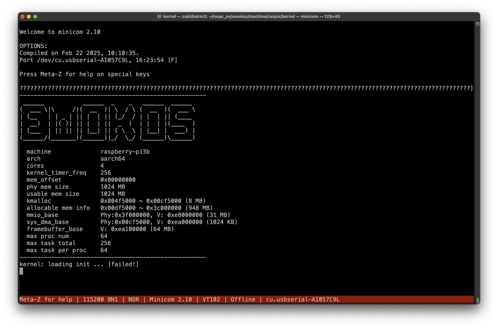

# aarch64対応版

- homebrewの`aarch64-elf-gcc`ではincludeがうまくいかずビルドできない
- [Arm GNU Toolchain](https://developer.arm.com/downloads/-/arm-gnu-toolchain-downloads)を使用する

## toolchainのインストール

```bash
$ wget https://developer.arm.com/-/media/Files/downloads/gnu/14.3.rel1/binrel/arm-gnu-toolchain-14.3.rel1-darwin-arm64-aarch64-none-elf.pkg
$ open arm-gnu-toolchain-14.3.rel1-darwin-arm64-aarch64-none-elf.pkg
$ vi ~/.bash_profile
export PATH=/Applications/ArmGNUToolchain/14.3.rel1/aarch64-none-elf/bin:$PATH
$ aarch64-none-elf-gcc -v
Using built-in specs.
COLLECT_GCC=aarch64-none-elf-gcc
COLLECT_LTO_WRAPPER=/Applications/ArmGNUToolchain/14.3.rel1/aarch64-none-elf/bin/../libexec/gcc/aarch64-none-elf/14.3.1/lto-wrapper
Target: aarch64-none-elf
Configured with: /Volumes/data/jenkins/workspace/GNU-toolchain/arm-14/src/gcc/configure --target=aarch64-none-elf --prefix=/Volumes/data/jenkins/workspace/GNU-toolchain/arm-14/build-aarch64-none-elf/install --with-gmp=/Volumes/data/jenkins/workspace/GNU-toolchain/arm-14/build-aarch64-none-elf/host-tools --with-mpfr=/Volumes/data/jenkins/workspace/GNU-toolchain/arm-14/build-aarch64-none-elf/host-tools --with-mpc=/Volumes/data/jenkins/workspace/GNU-toolchain/arm-14/build-aarch64-none-elf/host-tools --with-isl=/Volumes/data/jenkins/workspace/GNU-toolchain/arm-14/build-aarch64-none-elf/host-tools --disable-shared --disable-nls --disable-threads --disable-tls --enable-checking=release --enable-languages=c,c++,fortran --with-newlib --with-gnu-as --with-headers=yes --with-gnu-ld --with-native-system-header-dir=/include --with-sysroot=/Volumes/data/jenkins/workspace/GNU-toolchain/arm-14/build-aarch64-none-elf/install/aarch64-none-elf --with-bugurl=https://bugs.linaro.org/ --with-pkgversion='Arm GNU Toolchain 14.3.Rel1 (Build arm-14.174)'
Thread model: single
Supported LTO compression algorithms: zlib
gcc version 14.3.1 20250623 (Arm GNU Toolchain 14.3.Rel1 (Build arm-14.174))
```

## make

- kernel作成/QEMUによる実行用のMakefileは`machine/raspix/kernel/Makefile`
- system作成/sdカードイメージ作成用のMakefileは`machine/raspix/system/Makefile`
- 変数`ARCH`のデフォルト値は`aarch64`
- コンパイラ等の設定は`kernel/platform/aarch64/make.rule`

```bash
// 1. カーネルの作成
$ cd machine/raspix/kernel
$ make
aarch64-none-elf-objcopy -O binary ./kernel8.elf ./kernel8.img
$ ls
bsp        kernel8.elf  lib       make_err.log  make.log    README.md
config.mk  kernel8.img  make.bsp  Makefile      mkos.lds.S
// 2. systemの作成
$ cd machine/raspix/system
$ make basic
// 3. sdの作成
$ make sd
$ ls
basic_err.log  bin    drivers  libs      root_aarch64.ext2
basic.log      build  etc      Makefile
```

## QEMUで実行

```bash
$ cd machine/raspix/kernel
$ make run
qemu-system-aarch64 -M raspi3b -serial null -serial mon:stdio -kernel kernel8.img -sd ../../../machine/raspix/system/root_aarch64.ext2
WARNING: Image format was not specified for '../../../machine/raspix/system/root_aarch64.ext2' and probing guessed raw.
         Automatically detecting the format is dangerous for raw images, write operations on block 0 will be restricted.
         Specify the 'raw' format explicitly to remove the restrictions.

=== ewokos booting ===

kernel: init kernel malloc     ... [OK]
kernel: init kernel event      ... [OK]
kernel: init sd                ... [OK]
kernel: load kernel config     ... [OK]
kernel: remapping kernel mem   ... [OK]
-----------------------------------------------------
 ______           ______  _    _   ______  ______
(  ___ \|\     /|(  __  )| \  / \ (  __  )(  ___ \
| (__   | | _ | || |  | || (_/  / | |  | || (____
|  __)  | |( )| || |  | ||  _  (  | |  | |(____  )
| (___  | || || || |__| || ( \  \ | |__| |  ___) |
(______/(_______)(______)|_/  \_/ (______)\______)

  machine              raspberry-pi3b
  arch                 aarch64
  cores                4
  kernel_timer_freq    1024
  mem_offset           0x00000000
  phy mem size         1024 MB
  usable mem size      1024 MB
  kmalloc              0x004f5000 ~ 0x00cf5000 (8 MB)
  allocable mem info   0x00df5000 ~ 0x3c000000 (948 MB)
  mmio_base            Phy:0x3f000000, V: 0xe8000000 (31 MB)
  sys_dma_base         Phy:0x00cf5000, V: 0xea000000 (1024 KB)
  framebuffer_base     V: 0xea100000 (64 MB)
  max proc num         128
  max task total       512
  max task per proc    64
-----------------------------------------------------
kernel: loading init ... [ok]
kernel: start cores ... 0 1 2 3

[init process started]
init: /sbin/core         [ok]
init: /sbin/vfsd         [ok]
init: /sbin/sdfsd        [ok]
dev: /drivers/timerd [OK]
dev: /drivers/ramfsd [OK]
dev: /drivers/nulld [OK]
run: /sbin/sessiond [OK]
run: /bin/session [OK]

+-----Ewok micro-kernel OS-----------------------+
| https://github.com/MisaZhu/EwokOS.git          |
+------------------------------------------------+
[/dev/tty0] login: root
[/dev/tty0] password: ****
[/dev/tty0]:/# ls
    12k [lost+found]
     1k [drivers]
     1k [bin]
     1k [sbin]
     1k [etc]
     1k [dev]
     1k [tmp]
[/dev/tty0]:/# ls -l /bin
-rwxr-xr-x 501    20        514k cat
-rwxr-xr-x 501    20        506k mkfifo
-rwxr-xr-x 501    20        507k svcinfo
-rwxr-xr-x 501    20        525k md5
-rwxr-xr-x 501    20        595k dump
-rwxr-xr-x 501    20        239k echo
-rwxr-xr-x 501    20        520k ipcserv
-rwxr-xr-x 501    20        245k pwd
-rwxr-xr-x 501    20        519k test
-rwxr-xr-x 501    20        512k whoami
-rwxr-xr-x 501    20        227k sleep
-rwxr-xr-x 501    20        648k shell
-rwxr-xr-x 501    20        519k setux
-rwxr-xr-x 501    20        510k uname
-rwxr-xr-x 501    20        528k mmio
-rwxr-xr-x 501    20        529k tsaver
-rwxr-xr-x 501    20        245k elfinfo
-rwxr-xr-x 501    20        245k grep
-rwxr-xr-x 501    20        556k more
-rwxr-xr-x 501    20        300k head
-rwxr-xr-x 501    20        514k clear
-rwxr-xr-x 501    20        514k kill
-rwxr-xr-x 501    20        630k ps
-rwxr-xr-x 501    20        531k json
-rwxr-xr-x 501    20        520k bgrun
-rwxr-xr-x 501    20        608k devcmd
-rwxr-xr-x 501    20        506k mkdir
-rwxr-xr-x 501    20        506k mount
-rwxr-xr-x 501    20        506k sysinfo
-rwxr-xr-x 501    20        633k ls
-rwxr-xr-x 501    20        521k cp
-rwxr-xr-x 501    20        515k chown
-rwxr-xr-x 501    20        511k chmod
-rwxr-xr-x 501    20        512k rm
-rwxr-xr-x 501    20        516k rx
-rwxr-xr-x 501    20        525k login
-rwxr-xr-x 501    20        294k session
[/dev/tty0]:/# echo abc
abc
[/dev/tty0]:/# ps
OWNER    PID  FATH  CORE  STATE     PROC
kernel   0    -1    0:0%  blk[0]    /sbin/init
kernel   5    0     0:11% run       /sbin/core
kernel   6    0     0:2%  blk[6]    /sbin/vfsd
kernel   7    0     0:36% rdy       /sbin/sdfsd
root     10   0     2:5%  rdy       /drivers/raspix/uartd
root     12   0     1:2%  rdy       /drivers/timerd
root     14   0     1:0%  blk[14]   /drivers/ramfsd
root     16   0     1:0%  blk[16]   /drivers/nulld
root     18   0     2:0%  blk[18]   /sbin/sessiond
root     20   0     3:0%  wat[21]   /bin/session
root     21   20    3:0%  wat[30]   /bin/shell
root     30   21    3:34% run       /bin/ps

task_num: 12, memory: total 1024 MB, free 877 MB, shm 0 MB
cpu idle:  25%  82%  86%  54%
[/dev/tty0]:/# ls -l /dev
crw-rw-rw- root   root        0k *tty0
crw-rw-rw- root   root        0k *timer
crw-rw-rw- root   root        0k *null
[/dev/tty0]:/# ls -l /sbin
-rwxr-xr-x 501    20        532k sessiond
-rwxr-xr-x 501    20        629k init
-rwxr-xr-x 501    20        229k core
-rwxr-xr-x 501    20        535k vfsd
-rwxr-xr-x 501    20        525k telnetd
-rwxr-xr-x 501    20        595k httpd
-rwxr-xr-x 501    20        634k sdfsd
[/dev/tty0]:/# ls -l /etc
-rw-r--r-- 501    20          1k init.rd
drwxr-xr-x root   root        1k [kernel]
-rw-r--r-- 501    20          1k passwd
[/dev/tty0]:/# cat /etc/init.rd
@/bin/ipcserv /drivers/raspix/uartd         /dev/tty0
@set_stdio /dev/tty0

@/bin/ipcserv /drivers/timerd

@/bin/ipcserv /drivers/ramfsd          /tmp
@/bin/ipcserv /drivers/nulld           /dev/null

@/bin/ipcserv /sbin/sessiond
@/bin/bgrun /bin/session -r -t /dev/tty0
[/dev/tty0]:/# cat /etc/passwd
root:0:0:/home/root:/bin/shell:63a9f0ea7bb98050796b649e85481845
misa:100:100:/home/misa:/bin/shell:b201272a7344411b1dd09d7b8a3f25b3
guest:1000:1000:/tmp/home/guest:/bin/shell:[/dev/tty0]:/#
[/dev/tty0]:/# date
'date' not found!
[/dev/tty0]:/# sysinfo
machine            raspberry-pi3b
arch               aarch64
cores              4
kmalloc free       5/8 MB
phy mem size       1024 MB
usable mem size    1024 MB
free mem           876 MB
sys_dma_base       phy:0x00cf5000, V:0xea000000 (1024 KB)
mmio_base          Phy:0x3f000000, V:0xe8000000 (31 MB)
framebuffer_base   Phy:0x00000000, V:0xea100000 (64 MB)
[/dev/tty0]:/# EMU 10.0.2 monitor - type 'help' for more information
(qemu) quit
$
```

## 実機で実行

```bash
$ cd machine/raspix/system
$ make -f make_sd.mk sdcard
dd if=/dev/zero of=sd/boot.img seek=$((0x80000 - 1)) bs=512 count=1
1+0 records in
1+0 records out
512 bytes transferred in 0.000132 secs (3878788 bytes/sec)
mformat -F -c 1 -i sd/boot.img ::
mcopy -i sd/boot.img ../boot/kernel8.img ::kernel8.img;  mcopy -i sd/boot.img ../boot/config.txt ::config.txt;  mcopy -i sd/boot.img ../boot/bootcode.bin ::bootcode.bin;  mcopy -i sd/boot.img ../boot/fixup.dat ::fixup.dat;  mcopy -i sd/boot.img ../boot/start.elf ::start.elf;  mcopy -i sd/boot.img ../boot/COPYING.linux ::COPYING.linux;  mcopy -i sd/boot.img ../boot/LICENCE.broadcom ::LICENCE.broadcom;  mcopy -i sd/boot.img ../boot/armstub8.S ::armstub8.S;
dd if=/dev/zero of=sd/ext2.img bs=1024 count=767*1024
785408+0 records in
785408+0 records out
804257792 bytes transferred in 1.484834 secs (541648287 bytes/sec)
/opt/homebrew/Cellar/e2fsprogs/1.47.3/sbin/mke2fs -b 1024 -t ext2 -I 128 sd/ext2.img
mke2fs 1.47.3 (8-Jul-2025)
128-byte inodes cannot handle dates beyond 2038 and are deprecated
Creating filesystem with 785408 1k blocks and 49152 inodes
Filesystem UUID: 0636a4c2-3696-4f47-bd72-87cfb16fc4a1
Superblock backups stored on blocks:
	8193, 24577, 40961, 57345, 73729, 204801, 221185, 401409, 663553

Allocating group tables: done
Writing inode tables: done
Writing superblocks and filesystem accounting information: done

cd build; \
sudo chown -R 0:0 . ;\
sudo find . -type f | sudo e2cp -ap -G 0 -O 0 -d ../sd/ext2.img:/
dd if=/dev/zero of=ewokos.img seek=$((0x200000 - 1)) bs=512 count=1
1+0 records in
1+0 records out
512 bytes transferred in 0.000038 secs (13473684 bytes/sec)
printf "                                                                \
  0x800, $((0x80000*512 / 1024))K, c,\n      \
  526336, $((1570816*512 / 1024))K, L,\n  \
" | /opt/homebrew/Cellar/util-linux/2.41.1_1/sbin/sfdisk ewokos.img
このディスクを使用しているユーザがいないかどうかを調べています ... OK

ディスク ewokos.img: 1 GiB, 1073741824 バイト, 2097152 セクタ
単位: セクタ (1 * 512 = 512 バイト)
セクタサイズ (論理 / 物理): 512 バイト / 512 バイト
I/O サイズ (最小 / 推奨): 512 バイト / 512 バイト

>>> 新しい DOS (MBR) ディスクラベルを作成しました。識別子は 0x90dc8c8a です。
ewokos.img1: 新しいパーティション 1 をタイプ W95 FAT32 (LBA)、サイズ 256 MiB で作成しました。
ewokos.img2: 新しいパーティション 2 をタイプ Linux、サイズ 767 MiB で作成しました。
ewokos.img3: 終了。

新しい状態:
ディスクラベルのタイプ: dos
ディスク識別子: 0x90dc8c8a

デバイス    起動 開始位置 終了位置  セクタ サイズ Id タイプ
ewokos.img1          2048   526335  524288   256M  c W95 FAT32 (LBA)
ewokos.img2        526336  2097151 1570816   767M 83 Linux

パーティション情報が変更されました。
dd if=sd/boot.img of=ewokos.img seek=0x800 conv=notrunc
524288+0 records in
524288+0 records out
268435456 bytes transferred in 0.592854 secs (452785097 bytes/sec)
dd if=sd/ext2.img of=ewokos.img seek=526336 conv=notrunc
1570816+0 records in
1570816+0 records out
804257792 bytes transferred in 1.658817 secs (484838166 bytes/sec)

// カードに書き込み
// 実行
```



### imgファイルを調べる

#### ext2.img (ext2)

```bash
$ sudo losetup -o 269484032 -f ewokos.img
$ sudo losetup -l
NAME        SIZELIMIT    OFFSET AUTOCLEAR RO BACK-FILE                                        DIO LOG-SEC
/dev/loop1          0         0         1  1 /var/lib/snapd/snaps/core18_2923.snap              0     512
/dev/loop19         0 269484032         0  0 /home/vagrant/ewokos/ewokos.img                    0     512
$ sudo mount -t ext2 /dev/loop19 mnt
$ ls -l mnt
$ ls -l mnt
total 16
drwxr-xr-x 2 root root  1024 Jul 21 15:19 bin
drwxr-xr-x 3 root root  1024 Jul 21 15:19 drivers
drwxr-xr-x 3 root root  1024 Jul 21 15:19 etc
drwx------ 2 root root 12288 Jul 21 15:19 lost+found
drwxr-xr-x 2 root root  1024 Jul 21 15:19 sbin
$ cd mnt
mnt$ ls -l sbin
total 3704
-rwxr-xr-x 1 root root 234248 Jul 21 14:46 core
-rwxr-xr-x 1 root root 608872 Jul 21 14:46 httpd
-rwxr-xr-x 1 root root 643688 Jul 21 14:46 init
-rwxr-xr-x 1 root root 648368 Jul 21 14:46 sdfsd
-rwxr-xr-x 1 root root 543872 Jul 21 14:46 sessiond
-rwxr-xr-x 1 root root 537192 Jul 21 14:46 telnetd
-rwxr-xr-x 1 root root 547776 Jul 21 14:46 vfsd
$ file sbin/init
sbin/init: ELF 64-bit LSB executable, ARM aarch64, version 1 (SYSV), statically linked, with debug_info, not stripped
mnt$ cd ..
$ sudo umount mnt
$ sudo losetup -d /dev/loop19
```

#### boot.img (FAT)

```bash
$ sudo losetup -o 1048576 -f ewokos.img
$ cat /proc/filesystems
nodev	sysfs
nodev	tmpfs
nodev	bdev
nodev	proc
nodev	cgroup
nodev	cgroup2
nodev	cpuset
nodev	devtmpfs
nodev	configfs
nodev	debugfs
nodev	tracefs
nodev	securityfs
nodev	sockfs
nodev	bpf
nodev	pipefs
nodev	ramfs
nodev	hugetlbfs
nodev	devpts
	ext3
	ext2
	ext4
	squashfs
	vfat
nodev	ecryptfs
	fuseblk
nodev	fuse
nodev	fusectl
nodev	mqueue
nodev	pstore
	btrfs
nodev	autofs
nodev	binfmt_misc
	iso9660
nodev	vboxsf
$ sudo mount -t vfat /dev/loop19 mnt
$ ls -l mnt
total 3093
-rwxr-xr-x 1 root root    5756 Jul 22  2025 armstub8.S
-rwxr-xr-x 1 root root   52456 Jul 22  2025 bootcode.bin
-rwxr-xr-x 1 root root      46 Jul 22  2025 config.txt
-rwxr-xr-x 1 root root   18693 Jul 22  2025 COPYING.linux
-rwxr-xr-x 1 root root    7311 Jul 22  2025 fixup.dat
-rwxr-xr-x 1 root root  123144 Jul 22  2025 kernel8.img
-rwxr-xr-x 1 root root    1594 Jul 22  2025 LICENCE.broadcom
-rwxr-xr-x 1 root root 2955648 Jul 22  2025 start.elf
$ sudo umount mnt
$ sudo losetup -d /dev/loop19
```

### kernel作成のための修正ファイル

```bash
$ git diff -w
diff --git a/machine/raspix/system/Makefile b/machine/raspix/system/Makefile
index 7b46ea0b1..b826e8e46 100644
--- a/machine/raspix/system/Makefile
+++ b/machine/raspix/system/Makefile
@@ -74,7 +74,7 @@ sd:
 #256M ext2 sd
        dd if=/dev/zero of=${SD} bs=1k count=256k
 #make ext2 fs with: block_size=1024 inode_size=128
-       mke2fs -b 1024 -I 128 ${SD}
+       /opt/homebrew/Cellar/e2fsprogs/1.47.3/sbin/mke2fs -b 1024 -I 128 ${SD}

        cd $(MACHINE_BUILD_DIR); \
        find . -type f | e2cp -ap -G0 -O0 -d ../${SD}:/
diff --git a/machine/raspix/system/drivers/hid_joystickd/hid_joystickd.c b/machine/raspix/system/drivers/hid_joystickd/hid_joystickd.c
index 657f5dea0..8cdc165ba 100644
--- a/machine/raspix/system/drivers/hid_joystickd/hid_joystickd.c
+++ b/machine/raspix/system/drivers/hid_joystickd/hid_joystickd.c
@@ -6,6 +6,7 @@
 #include <ewoksys/vdevice.h>
 #include <ewoksys/ipc.h>
 #include <ewoksys/mmio.h>
+#include <ewoksys/proc.h>
 #include <fcntl.h>
 #include <ewoksys/keydef.h>

@@ -102,7 +103,7 @@ static int loop(void* p) {
                _down = false;
        }

-       usleep(10000);
+       proc_usleep(10000);
        return 0;
 }

diff --git a/machine/raspix/system/drivers/hid_keybd/hid_keybd.c b/machine/raspix/system/drivers/hid_keybd/hid_keybd.c
index a54f22bdd..946deca25 100644
--- a/machine/raspix/system/drivers/hid_keybd/hid_keybd.c
+++ b/machine/raspix/system/drivers/hid_keybd/hid_keybd.c
@@ -12,6 +12,8 @@
 #include <ewoksys/proc.h>
 #include <ewoksys/interrupt.h>
 #include <ewoksys/timer.h>
+#include <ewoksys/core.h>
+
 #include <fcntl.h>
 #include <ewoksys/keydef.h>

diff --git a/machine/raspix/system/drivers/hid_moused/hid_moused.c b/machine/raspix/system/drivers/hid_moused/hid_moused.c
index b60f51a41..f086f2ad6 100644
--- a/machine/raspix/system/drivers/hid_moused/hid_moused.c
+++ b/machine/raspix/system/drivers/hid_moused/hid_moused.c
@@ -6,6 +6,7 @@
 #include <ewoksys/ipc.h>
 #include <ewoksys/vdevice.h>
 #include <ewoksys/mmio.h>
+#include <ewoksys/proc.h>
 #include <fcntl.h>

 static int hid;
@@ -69,7 +70,7 @@ static int loop(void* p) {
        }

        ipc_enable();
-       usleep(3000);
+       proc_usleep(3000);
        return 0;
 }

diff --git a/machine/raspix/system/drivers/soundd/soundd.c b/machine/raspix/system/drivers/soundd/soundd.c
index 4932c6c8a..707749289 100644
--- a/machine/raspix/system/drivers/soundd/soundd.c
+++ b/machine/raspix/system/drivers/soundd/soundd.c
@@ -1,6 +1,9 @@
 #include <arch/bcm283x/gpio.h>
 #include <ewoksys/vdevice.h>
 #include <ewoksys/syscall.h>
+#include <ewoksys/proc.h>
+#include <ewoksys/klog.h>
+
 #include <string.h>
 #include <unistd.h>
 #include <ewoksys/dma.h>
diff --git a/machine/raspix/system/drivers/spi2uart/sc16is750.c b/machine/raspix/system/drivers/spi2uart/sc16is750.c
index 8cf415c10..50b3273c8 100644
--- a/machine/raspix/system/drivers/spi2uart/sc16is750.c
+++ b/machine/raspix/system/drivers/spi2uart/sc16is750.c
@@ -13,6 +13,8 @@ SC16IS750/752 Driver for RaspberryPi
 #include <arch/bcm283x/auxspi.h>
 #include <arch/bcm283x/i2c.h>
 #include <arch/bcm283x/gpio.h>
+#include <ewoksys/klog.h>
+#include <ewoksys/proc.h>

 #include "sc16is750.h"

@@ -126,13 +128,13 @@ uint8_t SC16IS750_ReadRegister(SC16IS750_t * dev, uint8_t channel, uint8_t reg_a
                //printf("result=0x%x\n",result);
        } else if (dev->protocol == SC16IS750_PROTOCOL_SPI) {   //register read operation via SPI
                bcm283x_gpio_write(dev->device_address_sspin, 0);
-               //usleep(10);
+               //proc_usleep(10);
                unsigned char spi_data[2];
                spi_data[0] = 0x80|(reg_addr<<3 | channel<<1);
                spi_data[1] = 0xff;
                //printf("spi_data[in]=0x%x 0x%x\n",spi_data[0],spi_data[1]);
                wiringPiSPIDataRW(dev->spi_channel, spi_data, 2);
-               //usleep(10);
+               //proc_usleep(10);
                bcm283x_gpio_write(dev->device_address_sspin, 1);
                //printf("spi_data[out]=0x%x 0x%x\n",spi_data[0],spi_data[1]);
                result = spi_data[1];
@@ -148,12 +150,12 @@ void SC16IS750_WriteRegister(SC16IS750_t * dev, uint8_t channel, uint8_t reg_add
                wiringPiI2CWriteReg8(dev->i2c_fd, (reg_addr<<3 | channel<<1), val);
        } else {
                bcm283x_gpio_write(dev->device_address_sspin, 0);
-               //usleep(10);
+               //proc_usleep(10);
                unsigned char spi_data[2];
                spi_data[0] = (reg_addr<<3 | channel<<1);
                spi_data[1] = val;
                wiringPiSPIDataRW(dev->spi_channel, spi_data, 2);
-               //usleep(10);
+               //proc_usleep(10);
                bcm283x_gpio_write(dev->device_address_sspin, 1);
        }
        return ;
@@ -606,7 +608,7 @@ int16_t SC16IS750_readwithtimeout(SC16IS750_t * dev, uint8_t * channel)
                        tmp = SC16IS750_read(dev, SC16IS750_CHANNEL_B);
                        if (tmp >= 0) return tmp;
                }
-               sleep(0);
+               proc_usleep(0);
        } while(retry_count < dev->timeout);
        return -1;       // -1 indicates timeout
 }
diff --git a/machine/raspix/system/drivers/usbd/usbd.c b/machine/raspix/system/drivers/usbd/usbd.c
index c152b674c..1b3e29e1c 100644
--- a/machine/raspix/system/drivers/usbd/usbd.c
+++ b/machine/raspix/system/drivers/usbd/usbd.c
@@ -8,6 +8,7 @@
 #include <ewoksys/vfs.h>
 #include <ewoksys/mmio.h>
 #include <ewoksys/dma.h>
+#include <ewoksys/klog.h>
 #include <usbd/usbd.h>
 #include <device/hid/keyboard.h>
 #include <device/hid/touch.h>
@@ -55,11 +56,14 @@ static int _last_y = 0;
 static int usb_step(void* p) {
        (void)p;
        //klog("detecting...\n");
+// TODO: TouchPersent()は未定義
+#if 0
     if(!TouchPersent()){
        UsbCheckForChange();
        proc_usleep(100000);
        return 0;
     }
+#endif

        struct TouchEvent event;
        int ret = TouchGetEvent(&event);
diff --git a/machine/raspix/system/libs/arch_bcm283x/src/emmc.c b/machine/raspix/system/libs/arch_bcm283x/src/emmc.c
index 8421b1486..f580674f3 100644
--- a/machine/raspix/system/libs/arch_bcm283x/src/emmc.c
+++ b/machine/raspix/system/libs/arch_bcm283x/src/emmc.c
@@ -5,6 +5,7 @@
 #include <ewoksys/syscall.h>
 #include <ewoksys/mmio.h>
 #include <ewoksys/kernel_tic.h>
+#include <ewoksys/proc.h>

 #define SD_OK                0
 #define SD_TIMEOUT          -1
@@ -522,4 +523,3 @@ int32_t emmc2_write_sector(int32_t sector, const void* buf) {
                return -1;
        return 0;
 }
-
diff --git a/machine/raspix/system/libs/arch_bcm283x/src/sdhost.c b/machine/raspix/system/libs/arch_bcm283x/src/sdhost.c
index 0b74904ac..04cf05af3 100644
--- a/machine/raspix/system/libs/arch_bcm283x/src/sdhost.c
+++ b/machine/raspix/system/libs/arch_bcm283x/src/sdhost.c
@@ -6,6 +6,7 @@
 #include <ewoksys/dma.h>
 #include <ewoksys/klog.h>
 #include <ewoksys/kernel_tic.h>
+#include <ewoksys/proc.h>

 #include <arch/bcm283x/gpio.h>
 #include <arch/bcm283x/mailbox.h>
diff --git a/system/basic/Makefile b/system/basic/Makefile
index 20af4b12d..147ef79ca 100644
--- a/system/basic/Makefile
+++ b/system/basic/Makefile
@@ -1,7 +1,7 @@
 BUILD_DIR = ../build/$(HW)
 TARGET_DIR = $(BUILD_DIR)/rootfs
 ROOT_DIR = ..
-ARCH = arm
+#ARCH = arm

 all: mkdirs basic_libs builtin_apps basic_drivers
        @echo "all done."
diff --git a/system/basic/libc/libewoksys/ewoksys/src/cmain.c b/system/basic/libc/libewoksys/ewoksys/src/cmain.c
index 8ff310be5..2c385548a 100644
--- a/system/basic/libc/libewoksys/ewoksys/src/cmain.c
+++ b/system/basic/libc/libewoksys/ewoksys/src/cmain.c
@@ -13,6 +13,7 @@
 #include <ewoksys/ipc.h>
 #include <procinfo.h>
 #include <unistd.h>
+#include <setenv.h>

 #ifdef __cplusplus
 extern "C" {
@@ -102,7 +103,7 @@ static void loadenv(void) {
                for(int i=0; i<n; i++) {
                        const char* name = proto_read_str(&out);
                        const char* value = proto_read_str(&out);
-                       setenv(name, value, 1);
+                       setenv(name, value);
                }
        }
        PF->clear(&out);
@@ -187,4 +188,3 @@ void _start(void) {
 #ifdef __cplusplus
 }
 #endif
-
diff --git a/system/basic/libc/libewoksys/ewoksys/src/dma.c b/system/basic/libc/libewoksys/ewoksys/src/dma.c
index de2e29346..109ce0a9b 100644
--- a/system/basic/libc/libewoksys/ewoksys/src/dma.c
+++ b/system/basic/libc/libewoksys/ewoksys/src/dma.c
@@ -11,7 +11,7 @@ ewokos_addr_t dma_alloc(int32_t dma_block_id, uint32_t size) {
 }

 void dma_free(int32_t dma_block_id, ewokos_addr_t vaddr) {
-       return syscall2(SYS_DMA_FREE, dma_block_id, vaddr);
+       syscall2(SYS_DMA_FREE, dma_block_id, vaddr);
 }

 uint32_t dma_phy_addr(int32_t dma_block_id, ewokos_addr_t vaddr) {
@@ -25,4 +25,3 @@ int32_t dma_set(ewokos_addr_t phy_base, uint32_t size, bool shared) {
 #ifdef __cplusplus
 }
 #endif
-
diff --git a/system/basic/libc/libewoksys/ewoksys/src/mstr.c b/system/basic/libc/libewoksys/ewoksys/src/mstr.c
index a3cf53439..8542e0eea 100644
--- a/system/basic/libc/libewoksys/ewoksys/src/mstr.c
+++ b/system/basic/libc/libewoksys/ewoksys/src/mstr.c
@@ -12,8 +12,10 @@ extern "C" {

 typedef void (*outc_func_t)(char c, void* p);

+#if 0
 extern void v_printf(outc_func_t outc, void* p, const char* format, va_list ap);
 extern int32_t snprintf(char *target, int32_t size, const char *format, ...);
+#endif

 /** str functions.-----------------------------*/

@@ -291,4 +293,3 @@ str_t* str_format_new(const char *format, ...) {
 #ifdef __cplusplus
 }
 #endif
-
```
